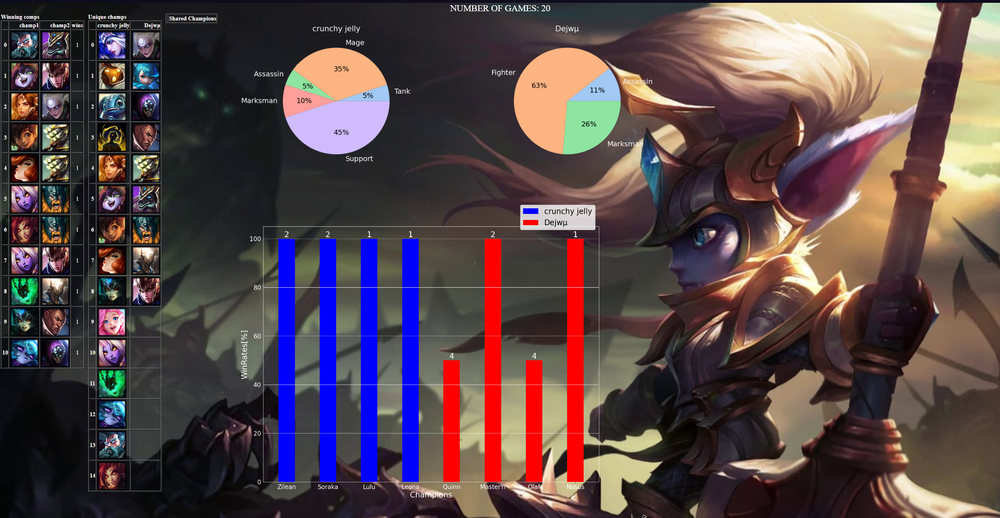

#Stats 4 two 

## Table of contents
* [General info](#general-info)
* [Technologies](#technologies)
* [Setup](#setup)
* [Description](#Description)
* [TO DO](#TO-DO)
* [Example](#Example)

## General info
 My first python project to learn python basics. Simple application for League of legends players that like to play in party of two. 

## Technologies
The project is developed using:
* Python
* MatplotLib, pandas, seaborn, requests
* Riot API
* HTML

## Setup
Application to run need riot API key witch has to be private, so i can`t shere my own, to generte you own riot API key head to site https://developer.riotgames.com and if you are logged in you can generete your own API key that lasts one day. With your own API key you can insert in file userData.py
When application is started it opens terminal and asks for two player names + tags, 

## Description
Application uses Riot API to collect data about players that play togehter, application provide stats:
- number of games played togheter,
- lists of chapions played by both players,
- list of champions groups that players won with and how many games,
- list of unique champions for each player,
- grapth of class distribution for each player
- column grapth that shows top 4 champions for each player, grapth contains number of games for each champion and % win rate.

Stats are displayed with html file. 

## TO DO
* Right now application works correctly if user collects information about only two the same players, if user tires to collect infromation about more players data will not be correct.
* Develop a mobile version
* Improve Stats visualisation, if lists are very long result page loses clarity
* Add more stats like highest demage dealt, most healing etc.
* Test Test Tests!

## Example
Example picture of html file with stats of two players:

I do not own any of champion portraits, all of them are own by Riot games.
Stats 4 two was created under Riot Games' "Legal Jibber Jabber" policy using assets owned by Riot Games.  Riot Games does not endorse or sponsor this project.
